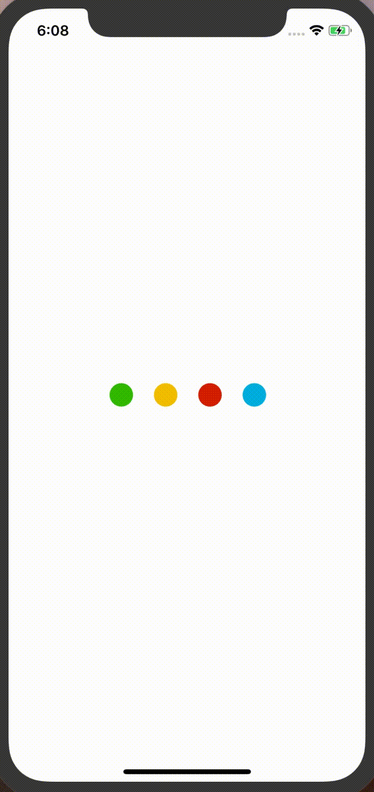
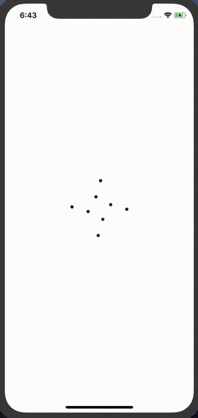
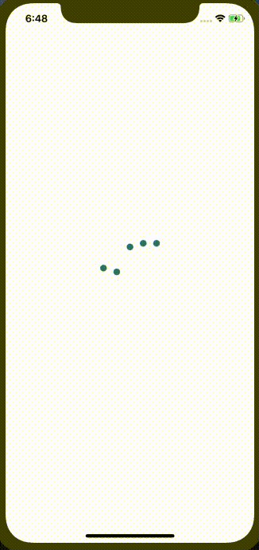

# React Native Animated Loader 

Read more about this package [here](https://www.freecodecamp.org/news/how-to-create-a-beautifully-animated-loader-in-react-native-21da37a8f6b0/).

[](http://npm-stats.com/~packages/react-native-animated-loader)
[](https://www.npmjs.com/package/react-native-animated-loader)
[](https://github.com/vikrantnegi/react-native-animated-loader/)
[](https://yarnpkg.com/en/package/react-native-animated-loader)

A React Native Loader Component which uses Airbnb's [Lottie](https://github.com/react-native-community/lottie-react-native) for beautiful loader animations.

 &nbsp;&nbsp;
 &nbsp;&nbsp;



## Prerequisites
### Using React Native CLI
This library uses [lottie-react-native](https://github.com/react-native-community/lottie-react-native) to render loader animations. Therefore this library need to be installed and linked to your project before installing this package.

Follow the official instruction and linking guide [here](https://github.com/react-native-community/lottie-react-native/blob/master/README.md#getting-started).

### Using Expo
No need to do anything specific, just install the package itself. Expo already has Lottie library API available and it will take care of the rest.

## Install

```
yarn add react-native-animated-loader
```
or
```
npm install react-native-animated-loader --save
```

## Usage
### Class Component
```jsx
import React from 'react';
import { StyleSheet,Text } from 'react-native';
import AnimatedLoader from "react-native-animated-loader";

export default class Loader extends React.Component {
  constructor(props) {
    super(props);
    this.state = { visible: false };
  }

  componentDidMount() {
    setInterval(() => {
      this.setState({
        visible: !this.state.visible
      });
    }, 2000);
  }

  render() {
    const { visible } = this.state;
    return (
      <AnimatedLoader
        visible={visible}
        overlayColor="rgba(255,255,255,0.75)"
        source={require("./loader.json")}
        animationStyle={styles.lottie}
        speed={1}
      >
        <Text>Doing something...</Text>
      </AnimatedLoader>
    );
  }
}

const styles = StyleSheet.create({
  lottie: {
    width: 100,
    height: 100
  }
});
```
### Functional Component

```jsx
import React, {useState, useEffect} from 'react';
import {StyleSheet, Text} from 'react-native';
import AnimatedLoader from 'react-native-animated-loader';
export default function App() {
  const [visible, setVisible] = useState(false);
  useEffect(() => {
    setInterval(() => {
      setVisible(!visible);
    }, 2000);
  }, []);

  return (
    <AnimatedLoader
      visible={visible}
      overlayColor="rgba(255,255,255,0.75)"
      animationStyle={styles.lottie}
      speed={1}>
      <Text>Doing something...</Text>
    </AnimatedLoader>
  );
}
const styles = StyleSheet.create({
  lottie: {
    width: 100,
    height: 100,
  },
});

```

### Usage in Expo
[Example for expo projects](https://snack.expo.dev/tTSGEcb5J)

### Loader files

You can find free lottie files for your loaders [here](https://lottiefiles.com/search?q=loader).

## Props

| Prop | Description | Default |
|---|---|---|
|**`source`**| The source of animation. Can be referenced as a local asset by a string, or remotely with an object with a `uri` property, or it can be an actual JS object of an animation, obtained (for example) with something like `require('../path/to/animation.json')`. | [Lottie Object](https://lottiefiles.com/1531-loader) |
|**`visible`**| Controls the visibility of the loader. | `false` |
|**`overlayColor`**| Changes the color of the overlay. | `rgba(255,255,255,0.75)` |
|**`animationStyle`**| The style to be applied to the Lottie. | - |
|**`animationType`**| Changes animation on show and hide loader's view. | `none` |
|**`speed`**| The speed the animation will progress. | `1` |
|**`loop`**| A boolean flag indicating whether or not the animation should loop. | `true` |

## Work in Progress
- [x] Add expo example
- [ ] Add ability to render text with animations
- [ ] Add test cases

## License
Licensed under the [MIT](https://github.com/vikrantnegi/react-native-animated-loader/blob/master/LICENSE).

## Donation
If this project helped you reduce time to develop, please consider buying me a cup of coffee :)

<a href="https://www.buymeacoffee.com/vikrantnegi" target="_blank"></a>

[](https://ko-fi.com/E1E6Z0JL)
